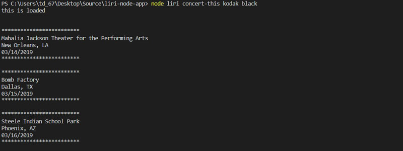

# liri-node-app

LIRI is a Language Interpretation and Recognition Interface. LIRI will be a command line node app that takes in parameters and gives you back data.

#
## Technical Specifications
* Node-Spotify-API
* OMDB API
* Bands In Town API
* Axios 
* Moment
* DotEnv
#
## Commands 
### Concert This
* node liri.js concert-this \<artist/band name here\>
    * Name of the venue
    * Venue location
    * Date of the Event (use moment to format this as "MM/DD/YYYY")
### Spotify This
* node liri.js spotify-this-song \<song name here\>
    * Artist(s)
    * The song's name
    * A preview link of the song from Spotify
    * The album that the song is from
### Movie This
* node liri.js movie-this \<movie name here\>
  * Title of the movie
  * Year the movie came out
  * IMDB Rating of the movie
  * Rotten Tomatoes Rating of the movie
  * Country where the movie was produced
  * Language of the movie
  * Plot of the movie
  * Actors in the movie

### Example Images

### Spotify This

### Movie This

### Concert This

### Do What It Says
